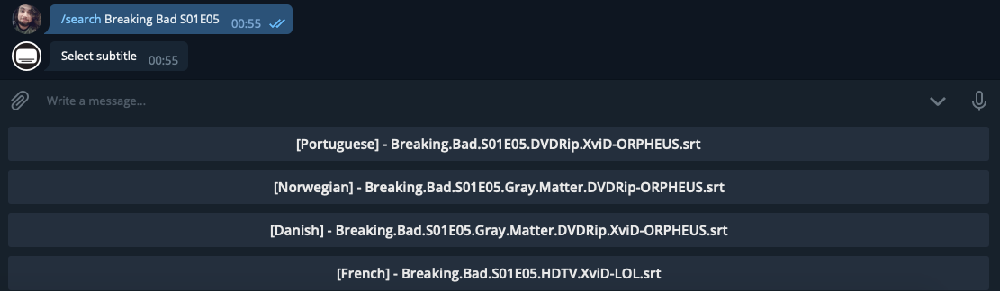

# OpenSubtitles Bot
Serverless Telegram bot for searching subtitles from OpenSubtitles.

<p align="center">
  
</p>

# Features
* /search `name`, `filename` or `imdbid` - Search subtitles
* /help - Help
* /upload - Link to upload subtitles
* /about - About

# Prerequisites
* [Node.js](https://nodejs.org/en/)

# Running
### 1. Telegram
````
# Create an Telegram bot
Find @BotFather on Telegram, type /newbot and follow the instructions.

# Credentials
Save your token from @BotFather.
````

### 2. OpenSubtitles
````
# Create an OpenSubtitles account
Create an OpenSubtitles account on https://opensubtitles.com/.

# API Key
Create an API key on https://www.opensubtitles.com/consumers.

# Credentials
Save your credentials from OpenSubtitles.
````

### 3. Vercel Deploy
````
# Account
Create an Vercel account on https://vercel.com/.

# Install Vercel CLI
npm install -g vercel

# Vercel CLI login
vercel login

# Deploy
vercel

# Set Vercel environment variables
TELEGRAM_USERNAME
TELEGRAM_TOKEN
OPENSUBTITLES_USERAGENT
OPENSUBTITLES_USERNAME
OPENSUBTITLES_PASSWORD
````

### 4. Setting up the Telegram webhook
````
curl --location --request POST https://api.telegram.org/bot<YOUR-TELEGRAM-TOKEN>/setWebhook --header 'Content-type: application/json' --data '{"url": "https://project-name.username.vercel.app/api/webhook"}'
````

# Built With
* [Node.js](https://nodejs.org/en/)

# Authors
* [xxgicoxx](https://github.com/xxgicoxx/)

# Acknowledgments
* [FlatIcon](https://www.flaticon.com/)
* [OpenSubtitles](https://www.opensubtitles.org/)